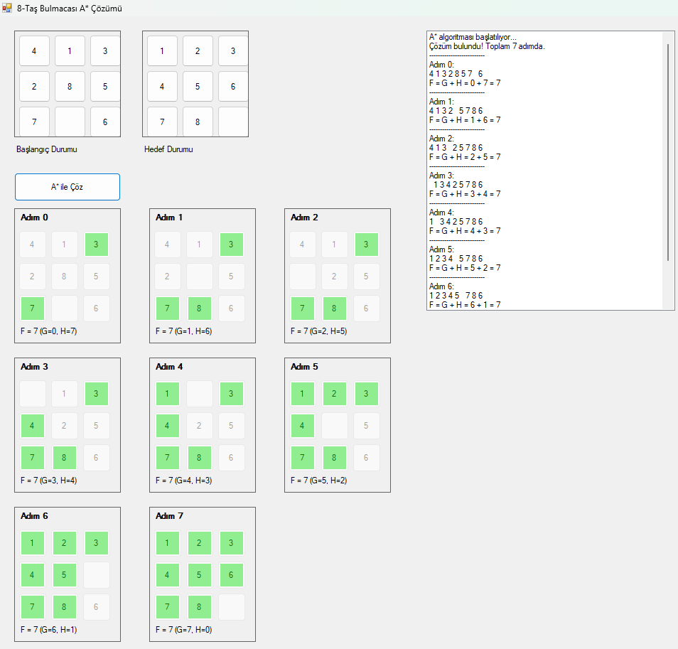

# A* Algoritma Uygulaması - 8-Taş Bulmacası Çözücü

Bu proje, yapay zeka alanında önemli bir yere sahip olan **A* arama algoritması**nı kullanarak 8-Taş Bulmacası problemini çözen interaktif bir C# Windows Forms uygulamasıdır.

## 🧠 Yapay Zeka Özellikleri

Bu proje aşağıdaki yapay zeka tekniklerini içerir:

- **A* Arama Algoritması**: Optimal yol bulma için kullanılan bilgili arama yöntemi
- **Heuristic Fonksiyon**: Manhattan mesafesi kullanarak hedefe kalan tahmini mesafeyi hesaplama
- **F = G + H Formülü**: Toplam maliyet hesaplama (G: gerçek maliyet, H: tahmini maliyet)
- **Problem Çözme**: Karmaşık durum uzayında en verimli çözüm yolunu bulma

## ✨ Özellikler

- **Interaktif Arayüz**: Başlangıç ve hedef durumları kullanıcı tarafından özelleştirilebilir
- **Görsel Çözüm**: Her adım hem metinsel hem de görsel olarak gösterilir
- **Adım Analizi**: F, G, H değerleri her adım için detaylı şekilde sunulur
- **Dinamik Form Boyutu**: Çözüm adım sayısına göre otomatik boyutlandırma
- **Durum Doğrulama**: Geçersiz durumları tespit etme ve uyarı sistemi

## 🛠️ Teknolojiler

- **C#**: Ana programlama dili
- **Windows Forms**: Kullanıcı arayüzü
- **A* Algorithm**: Yapay zeka arama algoritması
- **Manhattan Distance**: Heuristic fonksiyon

## 🚀 Kullanım

1. Uygulamayı çalıştırın
2. İsteğe bağlı olarak başlangıç durumunu düzenleyin (butonlara tıklayarak)
3. İsteğe bağlı olarak hedef durumunu düzenleyin
4. "A* ile Çöz" butonuna tıklayın
5. Çözüm adımlarını inceleyin

## 🔬 Algoritma Detayları

A* algoritması şu adımları takip eder:

1. **Başlangıç Durumu**: G=0, H=Manhattan mesafesi ile F değeri hesaplanır
2. **Açık Liste**: İşlenmeyi bekleyen düğümler saklanır
3. **Kapalı Liste**: İşlenmiş düğümler saklanır
4. **En İyi Düğüm Seçimi**: F değeri en düşük düğüm seçilir
5. **Komşu Durumlar**: Boş hücrenin hareket edebileceği 4 yön denenir
6. **Çözüm Yolu**: Parent bağlantıları takip edilerek optimal yol bulunur

## 📊 Sezgisel Fonksiyon

Manhattan mesafesi kullanılarak her taşın hedef konumuna olan uzaklığı hesaplanır:

H = Σ(|mevcut_satır - hedef_satır| + |mevcut_sütun - hedef_sütun|)

## 💡 Yapay Zeka Kavramları

- **Heuristic (Sezgisel)**: Hedefe kalan mesafeyi tahmin eden fonksiyon
- **Admissible Heuristic**: Asla gerçek maliyeti aşmayan tahmin
- **Optimal Search**: En kısa yolu garanti eden arama
- **State Space**: Tüm olası durumların oluşturduğu uzay

Bu proje, yapay zeka alanındaki temel arama algoritmalarından birini pratik bir örnek üzerinde uygulayarak hem algoritma mantığını hem de Windows Forms programlamasını öğrenme fırsatı sunar.
